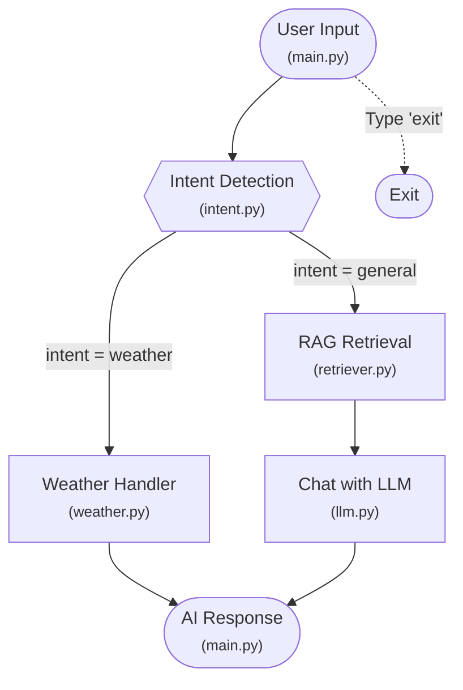

# ChatBotAppWithWeatherAPI

A conversational AI chatbot powered by Google Gemini and LangChain, with integrated weather information via OpenWeatherMap API and RAG (Retrieval-Augmented Generation) capabilities.

## Features
- Natural language chat using Gemini LLM (Google GenAI)
- Weather queries for any city (current temperature, humidity, etc.)
- RAG (Retrieval-Augmented Generation) with personal profile context
- Intent detection (weather/general chat)
- Vector database (ChromaDB) for semantic search
- Modular, extendable graph-based architecture (LangGraph)

## Project Structure
```
main.py                    # Entry point for the chatbot
app/
  llm.py                   # Gemini LLM integration
  intent.py                # Intent detection logic
  weather.py               # Weather API integration
  nodes.py                 # Graph nodes for intent, weather, chat
  graph.py                 # Graph construction and routing
  state.py                 # Agent state definition
  rag/
    ingest.py              # RAG data ingestion (personal profile)
    retriever.py           # Vector database retrieval
data/
  personal_profile.txt     # Personal profile for RAG context
vector_db/
  chroma/                  # ChromaDB vector store (auto-generated)
requirements.txt           # Python dependencies
.env                       # API keys (not committed)
.gitignore                 # Git ignore rules
AIenv/                     # Python virtual environment
```

## Setup Instructions

### 1. Clone the repository
```
git clone https://github.com/sagarcm13/Langchain-graph_AI_Chat_App.git
cd Langchain-graph_AI_Chat_App
```

### 2. Create and activate a virtual environment (recommended)
```
python3 -m venv AIenv
source AIenv/bin/activate
```

### 3. Install dependencies
```
pip install -r requirements.txt
```

### 4. Set up API keys
Create a `.env` file in the project root with the following content:
```
GEMINI_API_KEY=your_gemini_api_key_here
WEATHER_API_KEY=your_openweathermap_api_key_here
```
- [Get a Gemini API key](https://ai.google.dev/)
- [Get an OpenWeatherMap API key](https://openweathermap.org/api)

### 5. Set up personal profile (Optional - for RAG context)
If you want the chatbot to remember your personal information, update `data/personal_profile.txt` with your details:
```
Name: Your Name
About Me: Your background...
Education: Your education...
(etc.)
```

Then ingest it into the vector database:
```
python -c "from app.rag.ingest import ingest; ingest()"
```

### 6. Run the chatbot
```
python main.py
```


## Flow Diagram

<details>
<summary><strong>Click to expand flow diagram</strong></summary>



<br/>
<strong>Flow Description:</strong>

1. <strong>User Input</strong>: User types a message in the terminal (main.py).
2. <strong>Intent Detection</strong>: The message is analyzed to determine if it's a weather query or general chat (intent.py).
3. <strong>Weather Handler</strong>: If weather intent, fetches weather info for the city (weather.py).
4. <strong>RAG Retrieval</strong>: If general intent, retrieves relevant personal context from vector database (retriever.py).
5. <strong>Chat Handler</strong>: LLM responds using Gemini with personal context (llm.py).
6. <strong>AI Response</strong>: The response is printed to the user.
7. <strong>Exit</strong>: User can type 'exit' to quit at any time.

</details>

## Usage
- Type any message to chat with the AI (uses personal context from RAG).
- Ask about the weather in any city (e.g., "What's the weather in Paris?").
- Type `exit` to quit.

## Technologies Used
- **LangChain**: Framework for building AI applications
- **LangGraph**: Graph-based orchestration for multi-step workflows
- **Google Gemini**: Large Language Model (LLM)
- **ChromaDB**: Vector database for RAG
- **OpenWeatherMap**: Weather API
- **Python-dotenv**: Environment variable management

## Notes
- The vector database (ChromaDB) is stored in `vector_db/chroma/` and auto-regenerated when running RAG ingestion.
- API keys must be set in `.env` file (not committed to git).
- The personal profile data is used to provide contextual responses via RAG.

## License
MIT

## Example
```
🤖 Gemini AI Agent (type 'exit' to quit)

You: What's the weather in London?
AI: 🌦️ Weather in London
Temperature: 12°C
Feels like: 10°C
Humidity: 80%
Condition: Light Rain

You: Tell me a joke
AI: Why did the scarecrow win an award? Because he was outstanding in his field!
```

## Notes
- The `.env` file and `AIenv/` are excluded from version control.
- The chatbot uses Google Gemini for both intent detection and general chat.
- Weather data is fetched live from OpenWeatherMap.

## Requirements
See `requirements.txt` for all dependencies.
